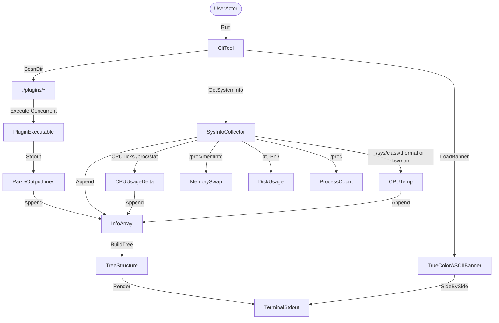

# Architecture and Decisions (ADRs)

This document records the system architecture and key design decisions for `arbol`.

## System Overview

`arbol` is designed as a dynamic, tree-structured terminal status reporter. It is written in Go and queries system resource endpoints, building and rendering a hierarchical tree structure side-by-side with OS logo banners.

## Key Components

### `cmd/arbol/main.go`
Entry point. Parses flags, calls `gatherInfo()`, and calls `renderOutput()`. Contains the tree builder and all node assembly logic.

### `cmd/arbol/sysinfo.go`
Platform-specific metric readers:
- `getOSName()`, `getDistroID()` — reads `/etc/os-release` or `sw_vers`
- `getCPU()` — reads `/proc/cpuinfo` or `sysctl`
- `getGPU()` — reads `lspci` or `system_profiler`
- `getMemory()`, `getSwap()` — reads `/proc/meminfo` or `vm_stat`
- `getDisk()` — runs `df -Ph /`
- `getDEWM()`, `getTerminal()` — reads environment variables
- `getProcesses()` — counts `/proc` numeric directories
- `getCPUUsage()` — samples `/proc/stat` twice with a 50ms delta to compute utilization
- `getCPUTemp()` — reads `/sys/class/thermal/thermal_zone*` then `/sys/class/hwmon/hwmon*/temp*_input`

### `cmd/arbol/render.go`
Visual layout utilities:
- `getBar(pct)` — renders a 10-block progress bar: `███░░░░░░░`
- `stripANSI(s)` — removes ANSI escape sequences

### `cmd/arbol/export.go`
Structured export printers for `--output`:
- `printJSON(info SystemInfo)` — serializes all fields including `cpu_usage` and `cpu_temp` as JSON
- `printXML(info SystemInfo)` — serializes as XML with `<arbol>` root and `<cpu_usage>` / `<cpu_temp>` tags
- `printTXT(info SystemInfo)` — plain-text key-value dump

### `plugins/`
Executable Bash scripts discovered at runtime:

| Script | Key Graphical Feature |
| :--- | :--- |
| `battery.sh` | ASCII health bar using `█` and `░` |
| `docker.sh` | Container name list with uptime from `docker ps` |
| `git.sh` | Staged/modified/untracked counters and sync status |
| `ip.sh` | Interface detection + Rx/Tx traffic totals in GB/MB |
| `k8s.sh` | kubectl context/namespace/API server |
| `media.sh` | playerctl now-playing metadata |
| `packages.sh` | Cross-package-manager counts + ratio distribution bar |
| `weather.sh` | wttr.in temperature + dynamic thermometer scale `❄️ ━━━█━━ 🔥` |

### `plugins/extended/`
Extended diagnostic panels rendered in the third column:

| Script | Output |
| :--- | :--- |
| `git_graph.sh` | `git log --oneline --graph` framed |
| `sys_dashboard.sh` | Load averages + top memory consumers |
| `weather_forecast.sh` | Full multi-day ASCII art from wttr.in |

## ADRs

### ADR 0001: Rune-Count Layout Sizing
**Status**: Accepted
**Date**: 2026-06-11

#### Context
Using byte-based length calculations (`len()` in Go) for padding caused visual misalignments since UTF-8 block-drawing symbols (like `█` and `░`) occupy 3 bytes but only 1 terminal column.

#### Decision
All visible string width calculations use Go's `utf8.RuneCountInString`, stripping ANSI sequences beforehand.

#### Consequences
- **Positive**: Visual alignments remain perfect regardless of color codes or block graphics.
- **Negative**: Negligible UTF-8 decoding overhead.

---

### ADR 0002: Modular Plugin Extensibility
**Status**: Accepted
**Date**: 2026-06-11

#### Context
Hardcoding extra rows (like Git branch or weather) bloats the core code and makes the tool rigid.

#### Decision
Implement a folder-based plugin scanner that looks for executables in `./plugins` and structures their outputs. Multi-line output: first line = parent node, subsequent lines = child nodes.

#### Consequences
- **Positive**: Users can write custom checks in any language without modifying the core binary.
- **Negative**: Subprocess execution overhead.

---

### ADR 0003: Dual-Sample CPU Usage via /proc/stat
**Status**: Accepted
**Date**: 2026-06-28

#### Context
A single read of `/proc/stat` yields absolute tick counts with no baseline; you cannot compute utilization from one sample alone.

#### Decision
`getCPUUsage()` reads `/proc/stat` twice with a 50ms `time.Sleep` in between and computes `(totalDiff - idleDiff) / totalDiff * 100`.

#### Consequences
- **Positive**: Accurate real-time CPU load percentage without external dependencies.
- **Negative**: Adds a fixed 50ms delay to startup time.

---

### ADR 0004: Plugin Output Graphical Conventions
**Status**: Accepted
**Date**: 2026-06-28

#### Context
Simple text-only plugin output makes the tree visually flat and uninformative compared to dedicated monitoring tools.

#### Decision
Plugins may use block characters (`█`, `▒`, `░`, `━`) and Unicode glyphs (emoji thermometers, arrows) to construct inline micro-charts. The core binary strips ANSI for `--output` serialization.

#### Consequences
- **Positive**: Rich visual density without breaking structured export.
- **Negative**: Requires a UTF-8 capable terminal with a Nerd Font for full glyph support.
